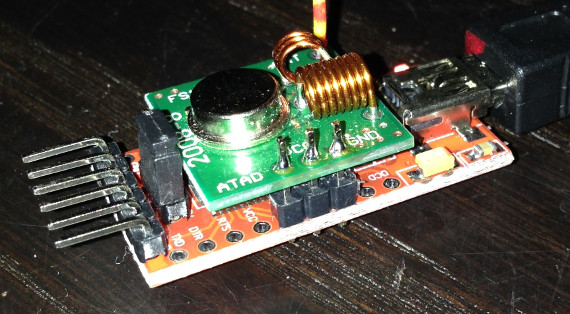
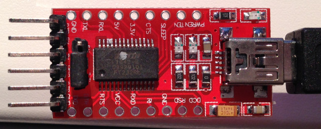
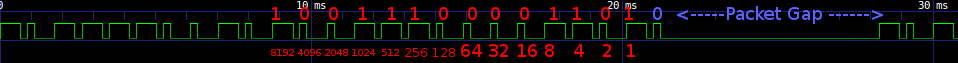
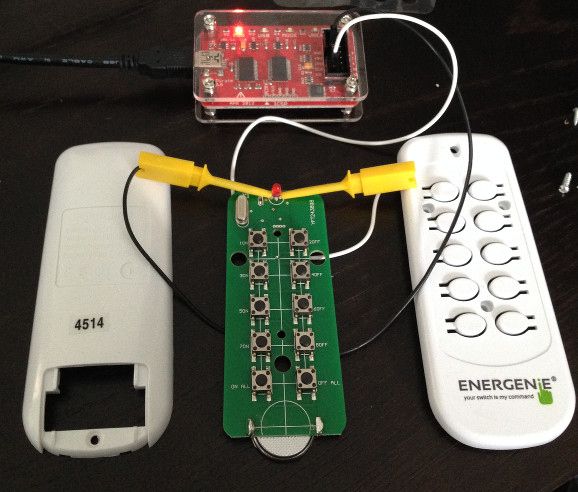
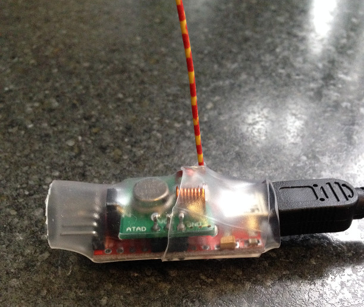

# energenie-bitbang
Using an FTDI FT232R chip in BitBang mode to control a 433MHz Energenie power socket via a simple 433MHz transmitter.


This has been tested on Ubuntu 15.04 x64 and Ubuntu 14.04.2 LTS x32 (and now on 20.04)

See wiki page for more info

https://www.richud.com/wiki/FT232R_BitBang_433MHz_Energenie_Power_Socket



Requirements
------------

An Energenie or compatible power socket.

A 433MHz transmitter such as the ubiquitous FS1000A (eBay, ~ £1)

A USB to TTL FT232RL adapter (eBay, ~ £2)



Compile
-------
```
sudo apt-get install libftdi-dev libftdi1 libusb-dev
git clone https://github.com/richud/energenie-bitbang.git
cd energenie-bitbang
make
sudo make install   [optional, install to /usr/bin]
```
Tested on ARMv6 (raspberry pi) and X86 architectures

Hardware Setup
--------------
FS1000A <> FT232R board
```
GND <> GND
VCC <> +5v/VCC/(RI)   (VCC marked RI on one of my ebay boards)
ATAD <> RXD
```
Any bitbang pin can be used connected to (ATAD)DATA, to change edit #define line in energenie.c


Usage
-----

./energenie code [serial]

e.g.

sudo ./energenie 123456 FMJ8095F

Programing it with the above code will mean 123456 switches on, 123455 off.


Examples
--------
code relates to sticker on your energenie plugs.
To work the actual codes to send out afraid you need to decode the remote.
(See wiki page how to, maybe someone knows how to get these more easily nowadays?)
```
Remote '4514' (sticker on plugs) code table
	ON			OFF
1	Received 12363535	Received 12363534
2	Received 12363527	Received 12363526
3	Received 12363531	Received 12363530
4	Received 12363523	Received 12363522
ALL	Received 12363533	Received 12363532
```




[serial] is the serial of your adapter so you can run multiple ones at the same time, e.g. A400fqa6
```
[    3.755805] usb 1-1.2: new full-speed USB device number 4 using dwc_otg
[    3.913320] usb 1-1.2: New USB device found, idVendor=0403, idProduct=6001, bcdDevice= 6.00
[    3.919097] usb 1-1.2: New USB device strings: Mfr=1, Product=2, SerialNumber=3
[    3.922119] usb 1-1.2: Product: FT232R USB UART
[    3.925100] usb 1-1.2: Manufacturer: FTDI
[    3.928058] usb 1-1.2: SerialNumber: A400fqa6
```
So to turn plug 1 on;

sudo ./energenie 12363535 A400fqa6


Thoughts
--------
Just revisited this again after 5 years to turn a fan on and off to dry a wall/floor after a water leak & got it running from a Pi3.

Completely reliable and range is about same as wifi at least!

Perhaps all the codes start 1236 and just cycle through last 4 digits with a bash script trying each one in turn if you dont want to decode your rwmote the hard way?

Finished Article
----------------


(with crappy looking but super thick heatshrink)
